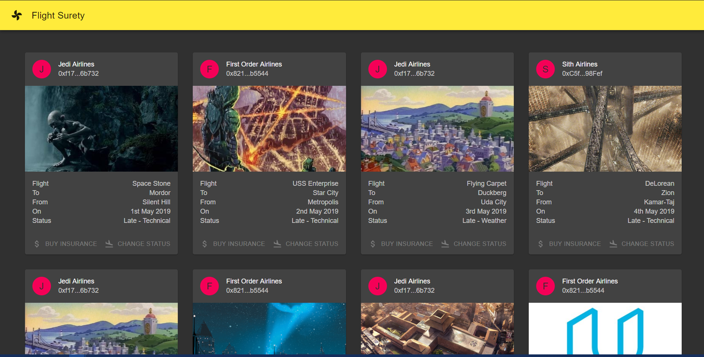

# flight-surety

A blockchain flight insurance application.

## CLI Requirements

Truffle ^5.0.19

Ganache CLI ^6.4.3

## Solidity Compiler Version Used

All contracts use solidity compiler version 0.5.8.

## Install

This repository contains Smart Contract code in Solidity (using Truffle), tests (also using Truffle), dApp scaffolding (using HTML, CSS and JS) and server app scaffolding.

To install, download or clone the repo, then:

`npm install`
`truffle compile`

## Ganache Startup

`ganache-cli -m "candy maple cake sugar pudding cream honey rich smooth crumble sweet treat" -a 30`

As we use more than the default 10 accounts, the a flag with the value of 30 is needed.

## Develop Client

To run truffle tests:

`truffle test ./test/flightSurety.js`
`truffle test ./test/oracles.js`

To use the dapp:

`truffle migrate`
`npm run dapp`

To view dapp:

`http://localhost:8000`

## Develop Server

`npm run server`
`truffle test ./test/oracles.js`

## Deploy

To build dapp for prod:
`npm run dapp:prod`

Deploy the contents of the ./dapp folder

## Job

Looking for an awesome blockchain job. Contact me on hfccr@outlook.com.